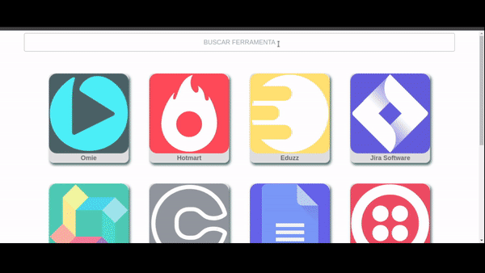

# Desafio Pluga

Desafio tecnico desenvolvido para a empresa <a href="https://pluga.co/" target="_blank" rel="external"><span><strong>Pluga</strong></span></a>

A aplicação é baseada em uma tela com uma lista (de cards) dos app integrados na Pluga com uma barra de busca, onde é possivel fazer uma consulta através da <strong> API Pluga</strong>

## 🛠️ Bibliotecas/Linguagens

* <a href="https://pt-br.reactjs.org/docs/getting-started.html" target="_blank" rel="external"><span><strong>React</strong></span></a> - React é uma biblioteca JavaScript para construção de interfaces de usuário.
* <a href="https://axios-http.com/docs/intro" target="_blank" rel="external"><span><strong>Axios</strong></span></a> - Axios é um cliente HTTP baseado em promessas para o node.Js e para o navegador.
* <a href="https://www.npmjs.com/package/react-modal" target="_blank" rel="external"><span><strong>React-modal</strong></span></a> - Componente de diálogo modal acessível para React.JS.
* <a href="https://openbase.com/js/uuidv4/documentation" target="_blank" rel="external"><span><strong>uuidv4</strong></span></a> - Gera Id's aleatórios
* Test - Foram feitos os testes da aplicação utilizando <a href="https://testing-library.com/docs/react-testing-library/intro/" target="_blank" rel="external"><span><strong>react-testing-library</strong></span></a> e jest, que podem ser verificados na pasta test da aplicação.

## Proposta


## Pagina(Aplicação)



## ⚙️ Como utilizar?

Clone o prjeto

```
git clone git@github.com:TamirisShigaki/desafio-pluga.git
```

Acesse o diretório clonado:

```
cd desafio-pluga
```

Instale as dependencias:

```
npm install
```

Execute a aplicação:

```
npm start
```

Execute os testes:

```
npm test
```

### Obrigada pela oportunidade, Pluga!

## Contato

<a href="https://www.linkedin.com/in/tamirisshigaki/" target="_blank" rel="external"></a>
